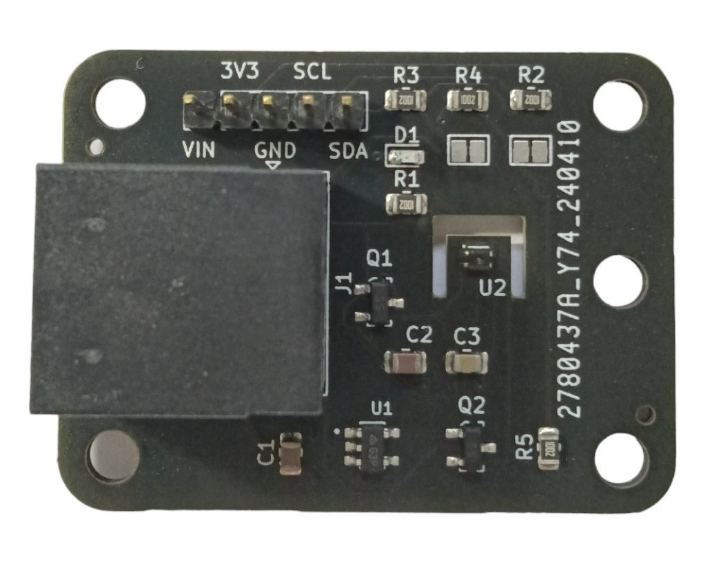

# Resistance Data Logger (RDL) by Jericho Lab

The RDL is an open-source suite of ready-to-use data logger and sensors designed for scientists and engineers.

The RDL is an open-source ready-to-use data logger designed for scientists and engineers.

For bugs and suggestions, users are invited to submit issues via Github.

Visit the official website: https://jericholab.com

**Purchase orders**  
Contact us via email or Linkedin.
 
**Licenses**  
SOFTWARE: GPL 3.0 license  
HARDWARE: MIT license  
WEBSITE & DOCUMENTS: Creative Commons CC-BY-NC-SA (Non-commercial use only)

For more information about the user permissions and responsibilities associated with each license, please refer to our website or contact us via email at info@jericholab.com. Thank you! 

<figure>

  

NAU7802 RevB1 for strain, force and current measurements
  

</figure>

<figure>

  

RDL I2C Shield, revA4
  

</figure>

<figure>

  

SHT4X revA4 for temperature and air humidity measurements
  

</figure>

